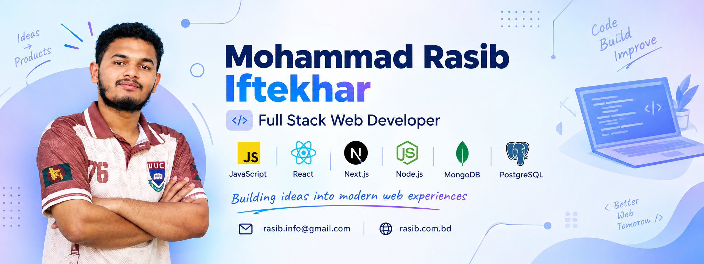

<!--- banner --->

 
 <!--- tittle --->

  <ul align="center">
    
<h1 style="display: inline-block">Hi 👋, I'm Mohammad Rasib Iftekhar Nabil</h1>

    <!--- typo --->
 

   
    
---

## 👨‍💻 About Me

I'm a **CSE student and aspiring full-stack web developer** passionate about building modern, responsive, and user-friendly web applications. I enjoy working with **JavaScript, React, Next.js, and Node.js**, while continuously exploring new technologies and improving my development skills.

Currently, I'm focused on **learning Next.js, building real-world projects, and strengthening my full-stack development skills**.

* 🔭 I’m currently working on full-stack web projects.
* 🌱 I’m currently learning Next.js and modern web development.
* 👯 I’m looking to collaborate on web development and open-source projects.
* 💬 Ask me about JavaScript, React, Next.js, and web development.
* 📫 How to reach me: **[rasib.info@gmail.com](mailto:rasib.info@gmail.com)**
* ⚡ Fun fact: I enjoy combining technology with creative design.

---

## 🛠️ Tech Stack

### **Frontend**

  
  
  
  
  
  

### **Backend & Database**

  
  
  
  

### **Tools & Design**

  
  
  
  
  
  

---

## 🌐 Connect With Me

  
  
  
  

---

## 📊 GitHub Activity

   

---

## 🔥 Contribution Streak

---

## 🚀 Currently Working On

| 🔭 Full Stack | 🌱 Learning | 🤝 Collaboration |
|:---:|:---:|:---:|
| Modern Web Apps | Next.js | Open Source |

---

## 💭 Developer Mindset

### `BUILD → LEARN → IMPROVE → REPEAT`

> **Every project is an opportunity to learn something new.**

---

## 📬 Let's Connect

**Have an idea, project, or collaboration in mind?**

  

